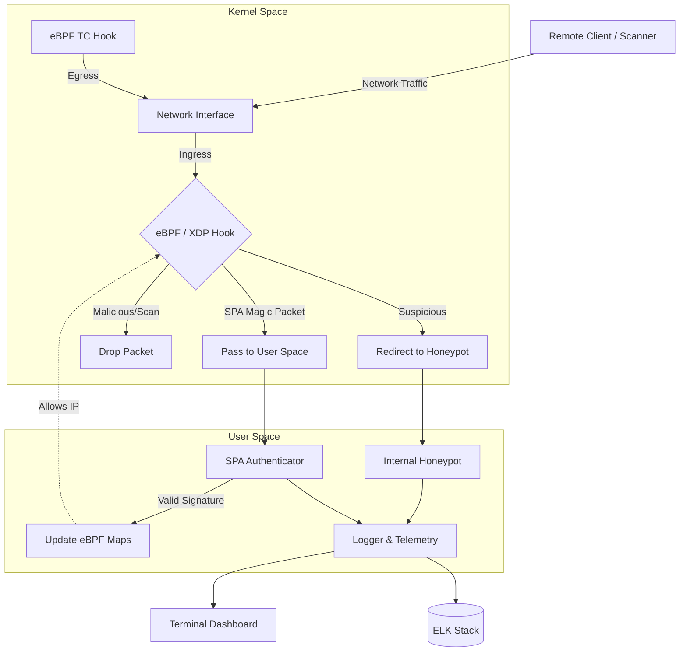

# Phantom Grid

[](https://opensource.org/licenses/MIT)
[](https://golang.org/)
[](https://www.kernel.org/)

Phantom Grid is a kernel-level active defense system designed to transform Linux servers into a highly controlled, deceptive attack surface. Leveraging eBPF (Extended Berkeley Packet Filter) and XDP (eXpress Data Path), it implements zero-trust network access, dynamic deception, and real-time threat intelligence directly at the network layer.

## Key Capabilities

### Zero-Trust Service Cloaking
Critical network services (e.g., SSH, database ports, management interfaces) are dropped at the XDP layer by default, rendering them invisible to network scanners. Authorized access is granted dynamically through **Single Packet Authorization (SPA)**.
- **Supported SPA Modes**: Static token, Dynamic HMAC, and Asymmetric (Ed25519 signatures combined with time-based OTPs) to prevent replay attacks.

### Active Deception
- **Dynamic Port Deception**: Simulates randomized, responsive services on unused ports to confound reconnaissance tools and port scanners.
- **Transparent Honeypot Redirection**: Intercepts malicious traffic targeting restricted segments and redirects it transparently to internal honeypots for behavioral analysis and logging.
- **OS Fingerprint Mutation**: Modifies TCP/IP packet headers in real-time to alter the apparent operating system signature, impeding automated exploit targeting.

### Egress Containment
Implements kernel-level data loss prevention (DLP) via Linux Traffic Control (TC), detecting and mitigating unauthorized outbound connections and data exfiltration attempts.

### Threat Intelligence & Monitoring
- **Terminal UI**: Provides a real-time, terminal-based dashboard for immediate threat visualization and forensics.
- **ELK Integration**: Natively exports structured security events to Elasticsearch for centralized monitoring and alerting.

## Architecture

Phantom Grid utilizes a split architecture between kernel space for high-performance packet processing and user space for control plane operations.



- **Kernel Space (eBPF/XDP)**: Executes high-speed packet filtering, transparent redirection, and header mutation at the lowest network layer.
- **User Space Agent**: Orchestrates eBPF program lifecycle, handles SPA verification, manages honeypot instances, and maintains the telemetry dashboard.
- **SPA Client**: A cross-platform utility used to generate and dispatch cryptographic authorization packets.

## Getting Started

### Prerequisites
- **Operating System**: Linux (Ubuntu 20.04+, Debian 11+, CentOS 8+)
- **Kernel Version**: 5.4 or higher (eBPF/XDP support required)
- **Go Toolkit**: 1.21 or higher
- **Dependencies**: `clang`, `llvm`, `libbpf-dev`, `make`

### Installation

```bash
git clone https://github.com/haidang-infosec/phantom-grid.git
cd phantom-grid

# Install build dependencies (Debian/Ubuntu example)
sudo apt update && sudo apt install -y clang llvm libbpf-dev golang-go make git

# Build binaries
make build

# Initialize cryptographic keys for SPA
./bin/spa-keygen -dir ./keys
openssl rand -base64 32 > keys/totp_secret.txt
```

### Usage

**Interactive Mode**
For deployment and management, Phantom Grid includes an interactive CLI utility:
```bash
./bin/phantom
```

**Daemon Execution**
To execute the agent directly specifying the network interface and authentication mode:
```bash
sudo ./bin/phantom-grid \
  -interface eth0 \
  -spa-mode asymmetric \
  -spa-key-dir ./keys \
  -spa-totp-secret "$(cat keys/totp_secret.txt)"
```

**Client Authentication**
To gain access to the protected services from a remote client:
```bash
./bin/spa-client -server <SERVER_IP> -mode asymmetric
```
Upon successful authorization, the firewall dynamically provisions access for a predefined window (default: 30 seconds).

## Documentation

Comprehensive documentation is provided in the `docs/` directory:
- [Installation Guide](docs/installation.md)
- [Configuration Reference](docs/configuration.md)
- [Single Packet Authorization (SPA)](docs/spa.md)
- [Architecture Details](docs/architecture.md)

## Development & Contribution

We welcome contributions. Please review the [Development Guide](docs/development.md) and [CONTRIBUTING.md](CONTRIBUTING.md) for workflow guidelines, coding standards, and testing procedures.

### Build Targets
- `make build`: Compile all binaries
- `make test`: Execute unit and integration tests
- `make generate`: Regenerate eBPF bindings

Please refer to [SECURITY.md](SECURITY.md) for vulnerability reporting procedures.

## License

Phantom Grid is distributed under the MIT License. See [LICENSE](LICENSE) for details.

## Disclaimer

This software is intended for authorized security research, defensive implementations, and testing purposes. Ensure compliance with all applicable local regulations and organizational policies prior to deployment.
