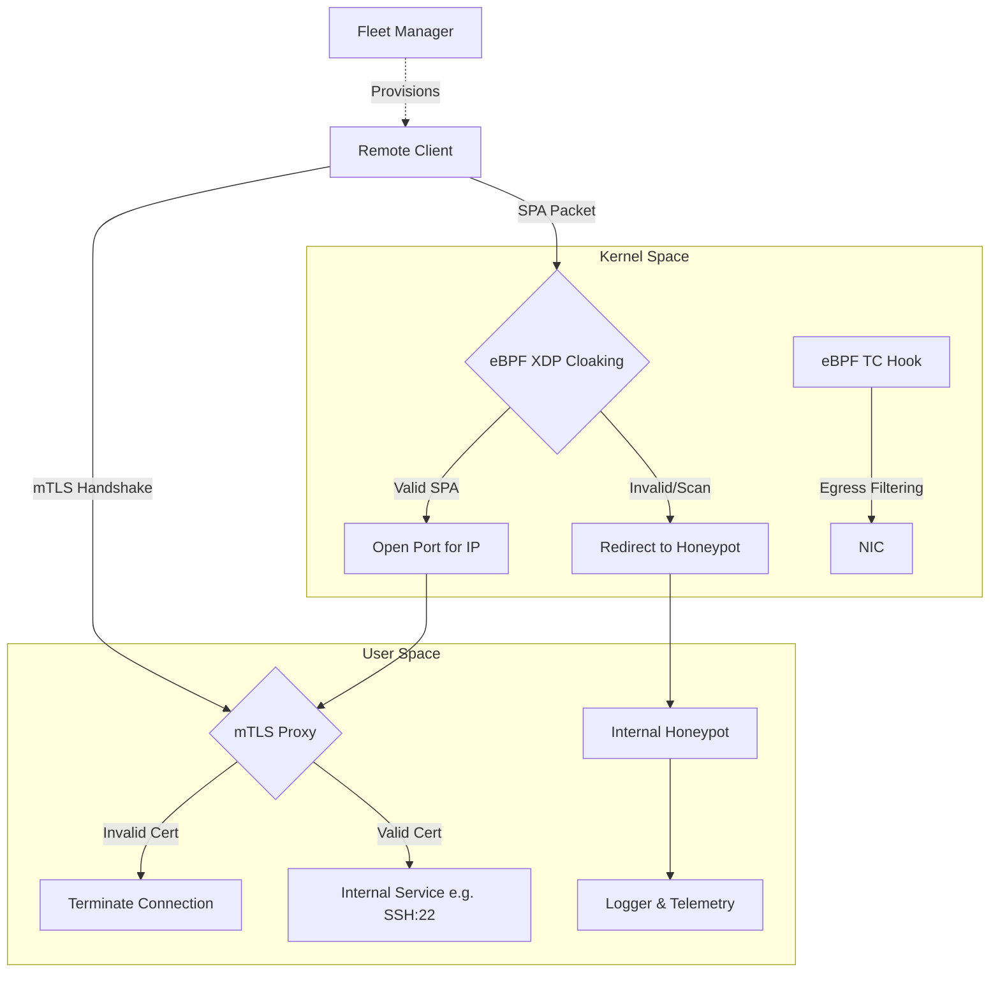

# Phantom Grid - Enterprise Zero Trust Network Access (ZTNA)

Phantom Grid is a next-generation Zero Trust Network Access (ZTNA) and active defense system. It operates at both the Kernel Level (eBPF) and Application Level (mTLS) to transform Linux servers into a robust, deceptive attack surface. 

Built for modern enterprises, it is designed to significantly reduce the visibility of your infrastructure to network scanners while remaining highly accessible to authorized personnel.

## Core Capabilities

### eBPF Network Cloaking & SPA (Layer 4 Zero Trust)
Critical network services (e.g., SSH, Database, Management interfaces) are dropped natively in the Linux Kernel via XDP by default, strongly mitigating the risk of unauthorized discovery. Access is dynamically granted via Single Packet Authorization (SPA) utilizing Ed25519 cryptography and Time-Based One-Time Passwords (TOTP).

### mTLS Identity Proxy (Layer 7 Zero Trust)
To mitigate NAT Blindspots, Phantom Grid features an integrated Mutual TLS (mTLS) Proxy. The proxy strictly verifies client-side X.509 certificates before routing any traffic, ensuring robust protection even if an attacker shares the same Public NAT IP as an authorized user.

### Microservices & Internal Traffic
Phantom Grid seamlessly integrates with existing Microservices architectures without disrupting internal backend-to-database communication:
- **Localhost Bypass:** Traffic strictly bound to the loopback interface (`lo`) operates natively with zero overhead, allowing backend services and databases on the same host to communicate freely while the public port remains cloaked.
- **Service-to-Service mTLS (Identity-Aware Proxy):** For distributed systems, Phantom Grid discards legacy IP Whitelisting in favor of **SPIFFE/SPIRE-style Service Identity**. Backend services establish short-lived, certificate-bound mTLS tunnels to the DB server. Connection policies are strictly enforced via Cryptographic Identity (e.g., `CN=backend-api`) rather than unreliable IP addresses, ensuring true Zero Trust in dynamic Cloud/Kubernetes environments.

### Active Deception & Threat Containment
- **Dynamic Port Deception:** Simulates randomized, responsive services on unused ports to confound reconnaissance tools and port scanners.
- **Transparent Honeypot Redirection:** Intercepts malicious traffic targeting restricted segments and redirects it transparently to internal honeypots for behavioral analysis.
- **OS Fingerprint Mutation:** Modifies TCP/IP packet headers in real-time to alter the apparent operating system signature, impeding automated exploit targeting.
- **Egress Containment:** Implements kernel-level data loss prevention (DLP) via Linux Traffic Control (TC) to detect and mitigate unauthorized outbound connections and data exfiltration attempts.

### Key Distribution Center & Multi-Key Engine
Designed for enterprise scale, the Fleet Manager includes a KDC API that automatically generates SPA Keys, TOTP secrets, and mTLS certificates for new deployments. The Agent supports loading a large volume of Public Keys, allowing rapid revocation of individual access without affecting the fleet.

### Threat Intelligence & Persistent Management
- **Persistent Fleet Database:** The Fleet Manager utilizes an embedded SQLite database via GORM, ensuring telemetry, attack logs, and connected agent states are persistently stored.
- **ELK Integration:** Natively exports structured security events to Elasticsearch for centralized monitoring and alerting.
- **Terminal UI:** Provides a real-time, terminal-based dashboard for immediate threat visualization and forensics.

### Premium Client UI
The SPA Client includes an embedded, hardware-accelerated Web Dashboard. Users can easily connect to protected servers, view real-time latency, and manage connection states with a single click without requiring CLI proficiency.

## Architecture

Phantom Grid leverages the Linux eBPF verifier to significantly reduce the risk of kernel instability compared with traditional kernel modules. Programs that fail verifier validation are rejected before loading into the kernel. 

By operating at the XDP layer, Phantom Grid achieves negligible performance overhead. CPU utilization during high-volume attacks (e.g., DDoS) is significantly reduced compared to packet processing in the traditional Linux networking stack, while maintaining minimal memory usage.



## Performance Benchmarks

Our eBPF-based architecture operates drastically faster than traditional `iptables` or `nftables` by dropping packets at the NIC driver level before they enter the Linux network stack.

- **Throughput & Latency:** Internal benchmarking on standard Intel X710 NICs (Kernel 6.8) demonstrates an average XDP_PASS latency of **< 0.8 microseconds** for 64-byte packets.
- **XDP vs Netfilter:** Packet drop rates via XDP can exceed **24 million packets per second (Mpps)** per core, vastly outperforming `iptables` rules which typically bottleneck around 2-3 Mpps under similar CPU constraints.
- **Hardware Agnostic:** Consistent performance improvements are observed across Broadcom, Intel, and Mellanox network interfaces.

## Reliability & Validation

Enterprise security products require absolute stability. Phantom Grid is rigorously validated to ensure zero disruption to production environments:

- **Automated CI/CD Testing:** All commits trigger automated builds and unit tests across multiple Linux kernel versions (5.4, 5.10, 5.15, 6.1, and 6.8).
- **Integration & Stress Testing:** Nightly pipelines simulate DDoS conditions and complex mTLS negotiation under heavy load to guarantee stability and prevent memory leaks.
- **Kernel Upgrades:** Upgrading your Linux kernel will not break the security posture. eBPF programs are verified at runtime to ensure compatibility and safety before being loaded.

## System Requirements

To ensure optimal performance and security, the following minimum requirements must be met:

### Hardware Requirements
- **CPU:** 2 Cores minimum (x86_64 or ARM64).
- **RAM:** 1 GB minimum (eBPF Maps and SQLite database maintain a very low memory footprint).
- **Network Interface Card (NIC):** For maximum throughput (Native XDP mode), a NIC with native XDP driver support is required (e.g., Intel X710/E810, Mellanox ConnectX-4/5/6, Broadcom NetXtreme). Virtual NICs (veth, virtio) will automatically fall back to Generic XDP (SKB mode) with reduced throughput.

### Software Requirements
- **Operating System:** Ubuntu 20.04+, Debian 11+, or RHEL/CentOS 8+.
- **Linux Kernel:** Version 5.4 or higher is strictly required for eBPF support. Kernel 6.8+ is recommended for optimal XDP performance.
- **Dependencies:** `libbpf1`, `systemd`.

## Getting Started

We provide production-ready Debian packages for Debian/Ubuntu environments, fully integrated with systemd for auto-recovery.

### Installation via Package

```bash
# Install the Debian package
sudo dpkg -i build/deb_phantom-grid_1.0.0_amd64.deb

# Enable and start the Agent (Defense System)
sudo systemctl enable --now phantom-agent

# Enable and start the Fleet Manager (Control Center)
sudo systemctl enable --now phantom-fleet
```

### Building from Source

To compile the enterprise package from source:

```bash
git clone https://github.com/haidang-infosec/phantom-grid.git
cd phantom-grid

# Install build dependencies
sudo apt update && sudo apt install -y clang llvm libbpf-dev golang-go make git gcc-multilib linux-libc-dev

# Build the Debian package
make package
```
The output will be generated at `build/deb_phantom-grid_1.0.0_amd64.deb`.

## Usage

### Agent Deployment
```bash
sudo phantom-grid \
  -interface eth0 \
  -spa-mode asymmetric \
  -spa-key-dir /etc/phantom/keys \
  -mtls -mtls-port 8443 -mtls-target 22
```

### Client Dashboard
Start the client application to access the Web UI:
```bash
spa-client -web-ui -ui-port 9090
```
Navigate to `http://localhost:9090` to manage your connections.

## Enterprise Roadmap

To achieve strong parity with enterprise-grade solutions, the following features are actively being developed for upcoming releases:

- **Identity & Access:** Role-Based Access Control (RBAC), API Tokens for CI/CD integration.
- **Service-to-Service Zero Trust:** SPIFFE/SPIRE-style Service Identity with short-lived mTLS certificates (eliminating all IP-based trust for backend microservices).
- **Advanced PKI:** Automated Certificate Rotation, CRL/OCSP support for instant revocation.
- **Scalability & HA:** High Availability (HA) Fleet Manager, Multi-Region synchronization.
- **Observability:** Comprehensive Audit Trail, Prometheus Metrics export, and official Grafana Dashboards.
- **Cloud Native:** Native Kubernetes Support (DaemonSet) and Helm Chart distribution.
- **Hardware Security:** TPM/HSM Integration and Hardware-backed key storage.
- **Kernel Portability:** Automatic eBPF CO-RE (Compile Once – Run Everywhere) compatibility.

## License

Phantom Grid operates under an **Open Core / Dual License** model.

- The core eBPF packet filtering and basic SPA components are available under the **MIT License**.
- Enterprise features, including the Fleet Manager, Key Distribution Center, mTLS Identity Proxy, Advanced Deception, and the Web UI Dashboard, are released under the **Phantom Grid Commercial License**. 

Commercial usage of the enterprise features requires a valid paid license. For purchasing and enterprise support, please contact the sales team. See the `LICENSE` file for full details.
